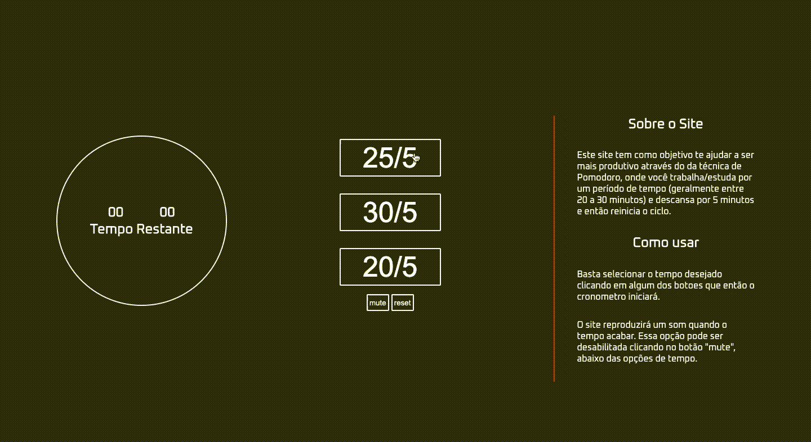

# pomodoro-watch
Este site tem como objetivo, além do estudo, ajudar no trabalho/estudo através do método de Pomodoro. Ele foi desenvolvido por mim, fazendo uso das linguagens: HTML, CSS e javascript. A ideia era um designer minimalista e um site funcional.

